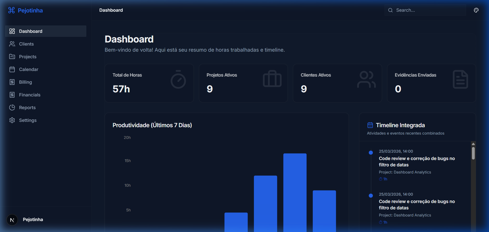
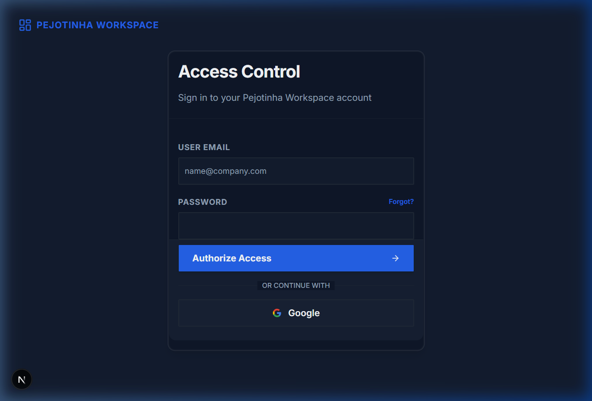
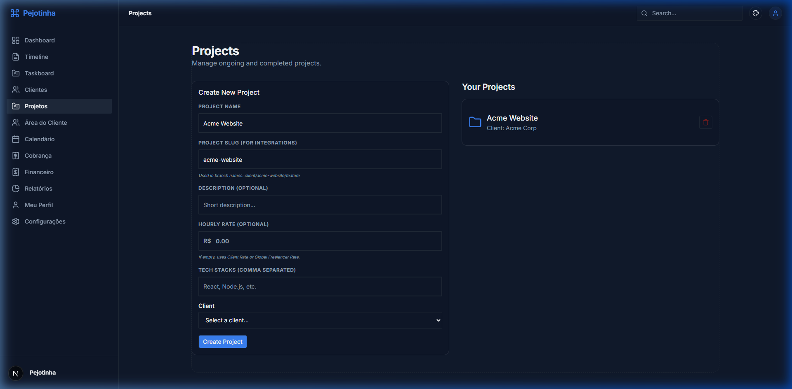
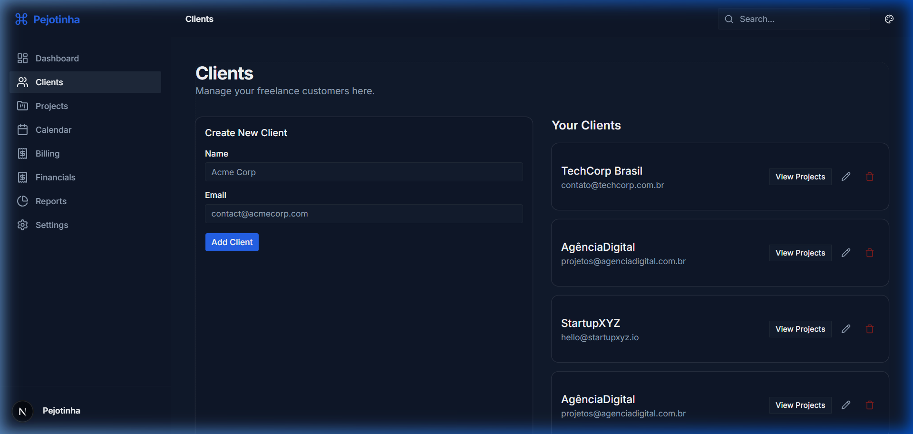
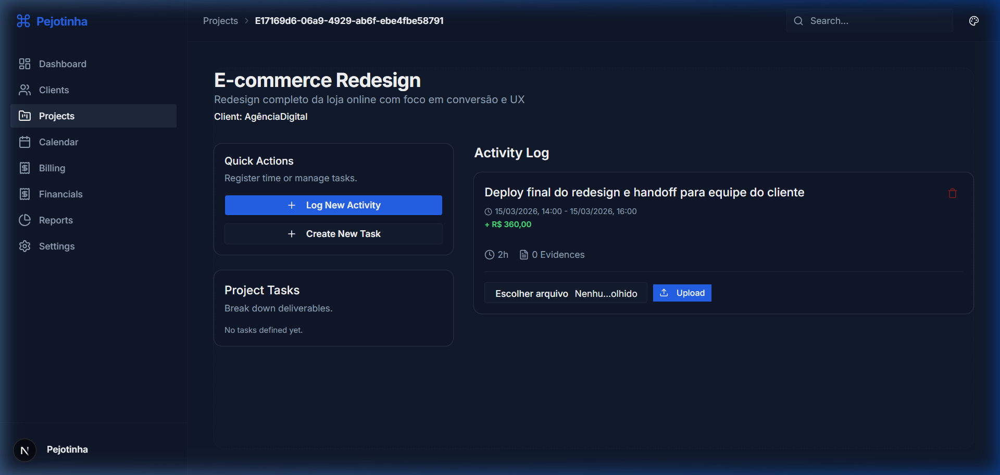
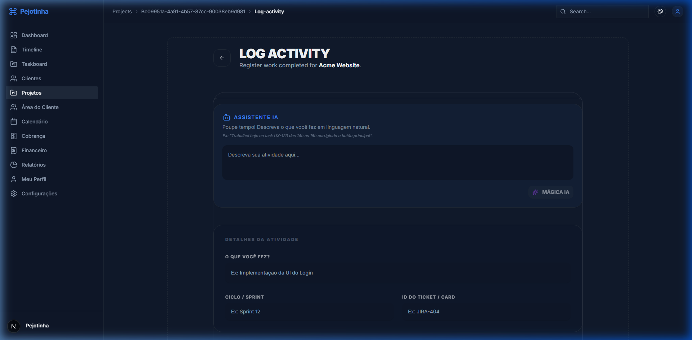

# 🚀 Pejotinha v4 - Freelancer Dashboard & Proof of Work

Pejotinha é uma plataforma SaaS multiusuário voltada para freelancers que desejam profissionalizar sua gestão de tempo, gastos e comprovação de trabalho. Focado em **Experiência do Usuário Premium** e **Segurança**, o sistema oferece uma timeline integrada de atividades, gestão de clientes e ferramentas de IA para automação de logs.

---

## ✨ Funcionalidades em Destaque

- **Signup & Auth**: Fluxo de cadastro integrado com Supabase Auth, suporte a **Google OAuth** e sincronização de perfis.
- **Agile Taskboard**: Kanban dinâmico com prioridades, tags e rastreio de tempo integrado por tarefa.
- **Internationalization (i18n)**: Suporte multi-idioma (Português/Inglês) com persistência de preferência e seletor de tema integrado.
- **Premium UI/UX**: Interface modernizada com **Layout Padronizado**, Glassmorphism, e suporte total a temas Dark/Light.
- **Proof of Work (PoW)**: Registro de atividades com evidências complexas (Arquivos + **Links Manuais**).
- **IA Assisted Logging**: Use linguagem natural para registrar suas horas com extração automática de metadados.
- **Account Management**: Área "My Profile" completa com gestão de senha e segurança.
- **Slug System**: Geração automática de URLs amigáveis para projetos em tempo real.
- **Vibe Coding History**: Histórico detalhado de todo o desenvolvimento em `/plans`.

---

## 🛠️ Tecnologias
- **Framework**: Next.js 16.2 (App Router & Turbopack), **next-intl** (i18n), **next-themes**.
- **Frontend**: Tailwind CSS v4, Lucide React, Framer Motion, Recharts.
- **Backend / BaaS**: Supabase (Self-hosted ou Cloud) - Auth, Storage, DB, RLS.
- **ORM**: Prisma 7 (PostgreSQL).
- **IA**: Vercel AI SDK (Google Gemini, Anthropic, OpenAI).
- **Infra**: Docker Multi-stage (Coolify-ready).

---

## 🏗️ Arquitetura Self-Hosted
Este projeto foi desenhado para ser totalmente independente. Diferente de outros SaaS que exigem contas pagas em serviços de nuvem, o Pejotinha permite que você rode **sua própria stack do Supabase** localmente ou em seu servidor através do **Supabase CLI**.

---

## 🚀 Configuração do Ambiente

O Pejotinha v4 suporta dois modelos de infraestrutura, dependendo da sua necessidade:

| Modelo | Descrição | Comando de Setup |
| --- | --- | --- |
| **A. Self-Hosted (Local)** | Supabase roda em Docker no seu PC. | `npm run setup` |
| **B. Cloud-Hosted (Nuvem)** | Usa sua conta no Supabase.com. | `npm run setup:cloud` |

---

### 📋 Pré-requisitos
Independente do modelo, você precisará de:
- **Node.js 20+** e **NPM 10+**.
- **Docker Desktop** (Apenas para o modo **Self-Hosted**).
- **Git** para clonar o projeto.

---

### 📦 Opção A: Self-Hosted (Local com Docker)
Ideal para desenvolvimento offline.

1. **Setup Inicial**:
   ```bash
   npm run setup
   ```
   *Escolha a opção **1** quando solicitado.*

2. **Iniciar App**:
   ```bash
   npm run dev
   ```

---

### ☁️ Opção B: Cloud-Hosted (Supabase.com)
Ideal para colaboração e paridade com produção.

1. **Setup Inicial**:
   ```bash
   npm run setup
   ```
   *Escolha a opção **2** quando solicitado.*

2. **Configurar Credenciais**:
   Edite o arquivo `.env.cloud` com seus dados reais do Dashboard.

3. **Publicar e Iniciar**:
   ```bash
   npm run db:push
   npm run dev
   ```

---

### 🔑 Acesso Padrão (Seed)
Após o setup, para o primeiro acesso, utilize estas credenciais:

| Perfil | Email | Senha |
| :--- | :--- | :--- |
| **Admin** | `admin@email.com` | `P@ssword!` |
| **Freelancer** | `freelancer@pejotinha.dev` | `P@ssword!` |

---

---

### 🩺 Verificação de Sanidade (Opcional)
```bash
npm run check:all
```
*Garante que Lint, Tipos e Saneamento do código estão OK.*

---

## 🏗️ Workflow de Desenvolvimento

Dependendo da sua escolha no setup, o seu workflow será ligeiramente diferente:

### 📦 Caminho A: Self-Hosted (Local Dev)
Ideal para iterações rápidas e total independência de internet/custos de nuvem.

1. **Alterar Schema**: Modifique `prisma/schema.prisma`.
2. **Sincronizar DB**: 
   ```bash
   npx prisma db push
   ```
3. **Se você estiver conectando ao **Supabase Cloud**, use o comando interativo:
```bash
npm run setup
```
Selecione a opção **2 (Cloud)**. O script configurará automaticamente os endereços otimizados da AWS (Pooler regional) para evitar erros de DNS no Windows.

### 🛠️ Supabase Cloud Troubleshooting
Se o `db:push` falhar com `P1001` (Can't reach database):
1.  Verifique se o seu host é o `aws-0-REGION.pooler.supabase.com` no seu `.env.cloud`.
2.  Garanta que o usuário no `.env.cloud` seja `postgres.[PROJECT_REF]`.
3.  O `DATABASE_URL` deve usar a porta **6543** para melhor compatibilidade.
4. **Ver no Studio Local**: [http://localhost:54323](http://localhost:54323)

---

### ☁️ Caminho B: Cloud-Hosted (Remote Dev)
Ideal para paridade com produção e colaboração em time.

1. **Alterar Schema**: Modifique `prisma/schema.prisma`.
2. **Push Remoto**: 
   ```bash
   npm run db:push:cloud
   ```
3. **Configuração Supabase**: O RLS e Triggers remotos são geridos via Painel do Supabase ou migrações SQL no SQL Editor do Dashboard.
4. **Variáveis Cloud**: O app deve ser iniciado com:
   ```bash
   npm run dev:cloud
   ```

---

## 🔌 Integrações e Automação (Webhooks)

O Pejotinha permite automatizar o registro de atividades através de Webhooks.

- **Git Commit Workflow**: Registre automaticamente seus commits como atividades vinculadas a projetos.
- **Husky Integration**: Automatize o envio de commits usando hooks de git locais.

Confira a [documentação de integrações](./docs/INTEGRATIONS.md) para saber como configurar.

---

## 📸 Screenshots

### Dashboard Desktop


### Access Control (SignUp/Login)


### Projects & Workspaces


### Client Management


### Project Details & Tasks


### Activity Registration (AI Assisted)


---

4. **Pare o Ambiente Local**:
   ```bash
   npm run stop
   ```

5. **Acesse as ferramentas**:
   - **Dashboard**: [http://localhost:3000](http://localhost:3000)
   - **Supabase Studio (Painel Admin)**: [http://localhost:54323](http://localhost:54323)
   - **Mailpit (Inbucket)**: [http://localhost:54324](http://localhost:54324)

---

## 🔑 Acesso Padrão (Seed)
Após o setup, o banco de dados virá populado com os seguintes dados de teste:

- **Admin**: `admin@email.com` / `P@ssword!`
- **Freelancer Teste**: `freelancer@pejotinha.dev` / `P@ssword!`

---

---

## 🚀 Publicação e Deploy

O Pejotinha é inteligente e sabe para onde deve ir:

1. **Deploy Local (Self-Hosted)**:
   Se você escolheu a Opção A no setup, o comando:
   ```bash
   npm run deploy
   ```
   Irá buildar uma imagem Docker otimizada e subir para o seu registry (padrão GHCR).

2. **Deploy Cloud (Supabase)**:
   Se você escolheu a Opção B no setup, o comando:
   ```bash
   npm run deploy
   ```
   Irá sincronizar o seu banco de dados e as Edge Functions locais com o seu projeto no Supabase Dashboard.

---

## 🛡️ Segurança e Desenvolvimento (CI/CD Local)
Este projeto utiliza **Husky**, **Lint-Staged** e **Secretlint** para garantir a qualidade e segurança do código.
- **Pré-commit**: Toda tentativa de commit irá rodar uma verificação de segurança automática para impedir que credenciais (API Keys, Secrets) sejam vazadas no repositório.

---

## 🔐 Segurança e Criptografia
Para proteger as credenciais de integração dos usuários (Tokens de Telegram, API Keys), o Pejotinha utiliza criptografia **AES-256-GCM**.
- O segredo de criptografia é gerado automaticamente no arquivo `.env` durante o setup (`ENCRYPTION_SECRET`).
- **IMPORTANTE**: Nunca perca este segredo em produção, ou os dados criptografados serão ilegíveis.

---

## 🤝 Contribuição
1. Crie uma branch para sua feature (`git checkout -b feature/nova-feature`).
2. Commit suas mudanças (`git commit -m 'Add nova feature'`).
3. Push para a branch (`git push origin feature/nova-feature`).
4. Abra um Pull Request.

---

## 📄 Licença
Desenvolvido por **Jone Polvora**. Este projeto é focado em produtividade para a comunidade freelancer.